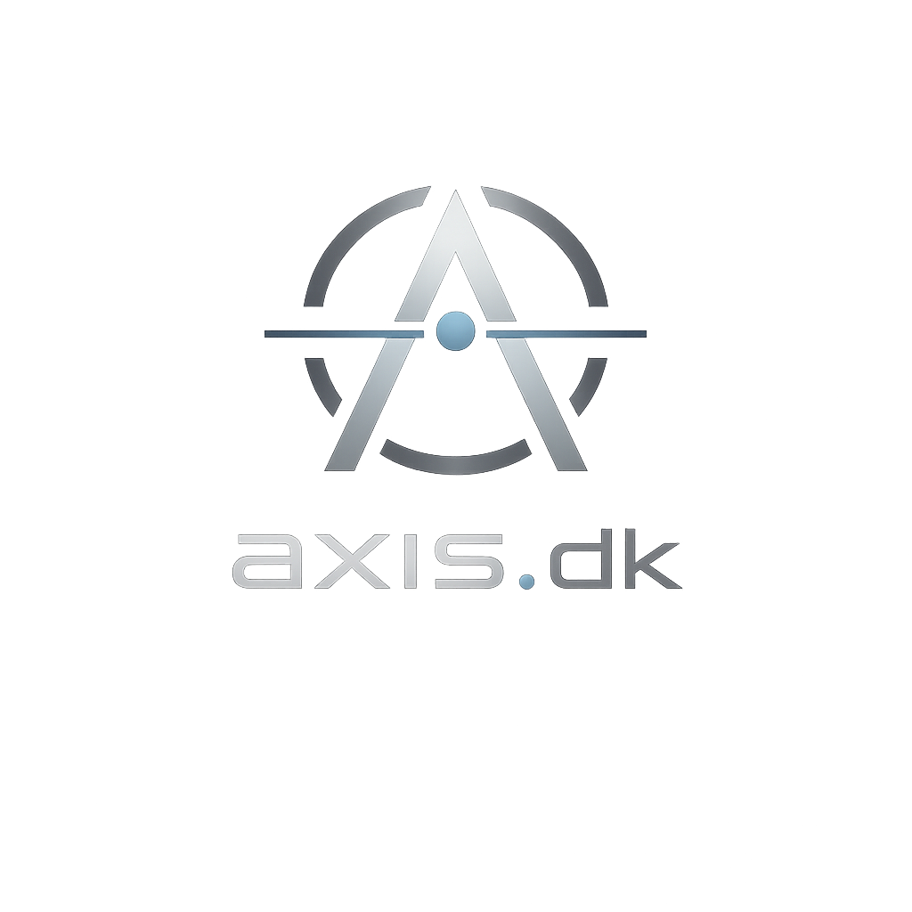

# axis.dk

### Architect · Execute · Integrate · Scale

Modern infrastructure engineering.

---

## About

**axis.dk** is a personal engineering platform focused on building modern infrastructure through architecture, automation, and continuous improvement.

This organization contains projects, documentation, tooling, and experiments across infrastructure, networking, platform engineering, and software development.

---

## What You'll Find

- Infrastructure Projects
- Platform Engineering
- Networking
- Automation
- Documentation
- Open Source Contributions

---

## Featured Repositories

| Repository | Description |
|------------|-------------|
| Infrastructure | Infrastructure as Code and platform configuration |
| Networking | Network architecture and design |
| Automation | Operational tooling and automation |
| Documentation | Engineering notes and reference material |
| Monitoring | Observability and platform monitoring |

---

## Current Focus

- Building reliable infrastructure
- Automating operations
- Documenting systems
- Exploring modern platforms
- Sharing practical engineering knowledge

---

**axis.dk**

*Architect · Execute · Integrate · Scale*

